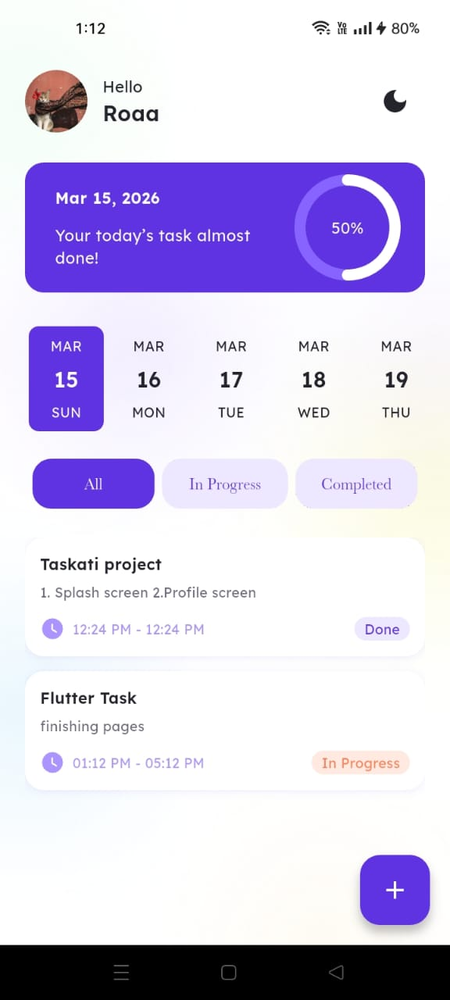
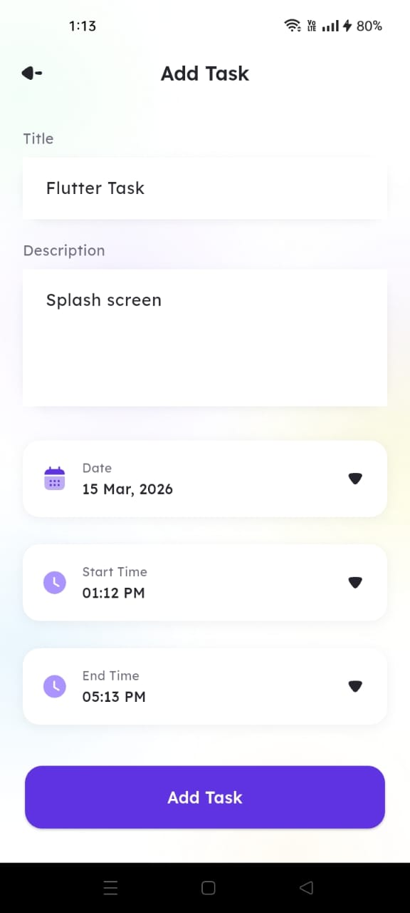
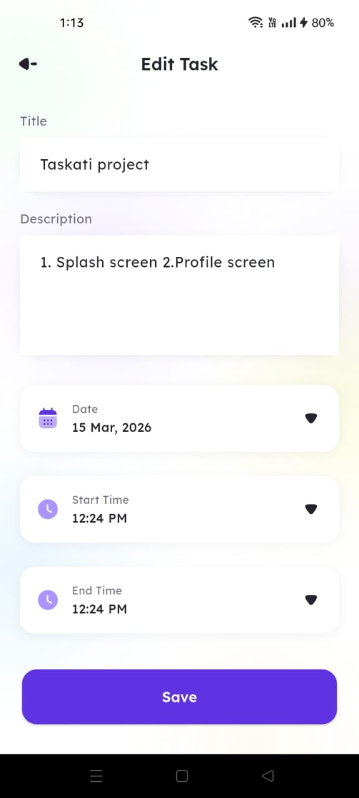
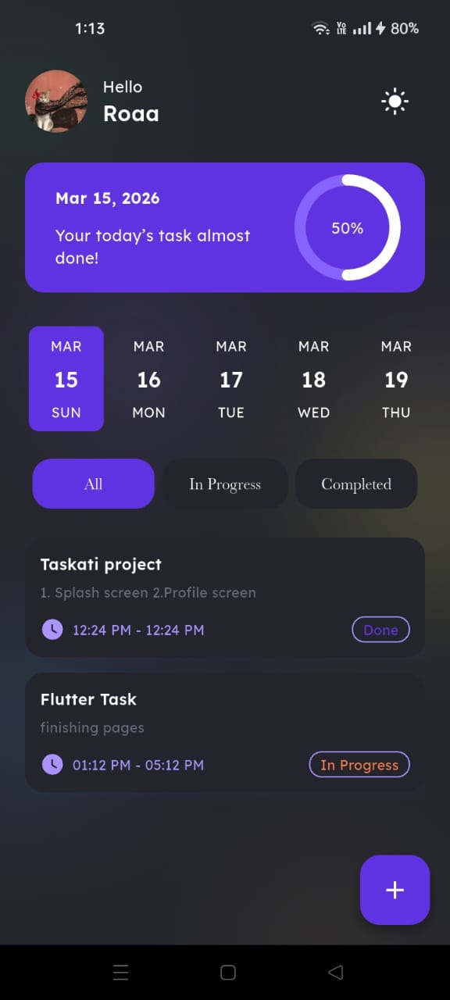

# 📝 Taskati - Task Management App 🚀

<p align="center">
  
  
  
</p>

---

## 📖 Description
**Taskati** is a professional productivity application designed to help users manage their daily tasks efficiently. With a clean UI and local storage capabilities, users can track their progress, set deadlines, and customize their profile experience.

---

## 📱 App Journey
<p align="center">
  
  
  
</p>

<p align="center">
  
  
  
</p>

<p align="center">
  
  
  
</p>

<p align="center">
  
  
</p>

---

## 🚀 Key Features

* **User Personalization:** Change name and profile picture (stored locally).
* **Daily Task Tracking:** Add, edit, and delete tasks with ease.
* **Circle Progress Indicator:** Visual representation of your daily task completion percentage.
* **Date & Time Picking:** Select deadlines using a sleek user interface.
* **Dark & Light Mode:** Fully adaptive theme support.
* **Offline First:** Powered by **Hive** for fast, local data persistence.

---

## 🛠️ Tech Stack & Packages

| Feature | Technology/Package |
| :--- | :--- |
| **Framework** | Flutter |
| **Language** | Dart |
| **Database** | Hive |

---

## 📦 Installation

1. **Clone the repository**
   ```bash
   git clone https://github.com/Roaa19/Taskati
   cd taskati
